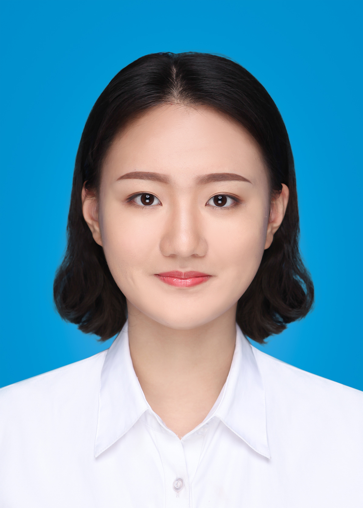

## Welcome my homepage

My name is Liu Ruofan, I am fresh graduate from National University of Singapore. I am incoming CS PhD candidate under the supervision of Prof. Dong Jinsong. I am currently working as a Cyber Security Research Assistant in Singtel-NUS Cybersecurity Research Lab. My research interest is in AI’s application in cybersecurity. 

### Project experiences 
#### Final Year Project on Deep Learning with Medical Images
- Built Segmentation Unet model to extract lesions that are correlated with eye disease(Diabetic Retinopathy) using Pytorch
- Developed ResNet network to classify images into 5 stages of Diabetic Retinopathy with limited amount of training data using Pytorch and achieve 80.16% classification accuracy
- Verified that using segmentation before classification can improve accuracy by 5%

### Awards
- Graduated from NUS with Honours (Highest Distinction) in Statistics and minor in Economics
- Lijen Industrial Development Medal(Best Academic Exercise/Projects in the Discipline) in Academic Year 2019
- NTUC Medal in Academic Year 2019
- Saw Swee Hock Gold Medal in Academic Year 2019
- SNAS Award 2020 

### Contacts 
- Email: kelseyliu1998@gmail.com
- LinkedIn: <a href=www.linkedin.com/in/ruofanliu>www.linkedin.com/in/ruofanliu</a>
